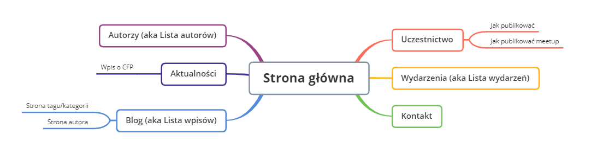

## Co porzebujemy?

- Nowe logo (byle nie ninja i inne kreskówki i latajacy fajfus)
- Nowe key visual
- Nowe design strony (wersja normlana i landing page eventowy inne kolory od głównej)
- Generycznych obraz og-image (og-image, cover filmu w 1920x1080px, og-image/cover dla eventu, og-image/cover dla meetup)
- Banery do social media

Zasady użytkowania grafik, logo (księga znaku/branding book)

## Mapa strony

## Strona

- Główna strona
- Jak publikować
- Jak publikować meetup
- Strona tagu/kategorii
- Strona autora
- Post
- Lista wpisów
- Lista wydarzeń
- Wpis wydarzenia
- Wpis o CFP (automat)
- Lista autorów
- Partnerzy?

### Główna strona
- Krótkie info o community (kim jesteśmy), moze być na tle banner-u
- Najblizsze wydarzenia (2-3, reszta na stronie z listą wydarzeń)
- Najnowsze wpisy na blog community
- Sponsorzy
- miejsce pod hero/lead do promowania 3 rzeczy (blog, cfp, wydarzenie)

### Jak publikować

- instrukcja jak lokalnie skonfigurować stronę - jako opcja może skrypt do tego gdzie wykorzystamy github cli żeby zrobić forka
- wymagania formalne co do publikowanej treści

### Jak publikować meetup

### Strona tagu/kategorii

### Strona autora

- bio/about me
- name
- github profile
- linked in profile
- twitter profile
- facebook profile
- website link
- image url
- wpisy autora

### Post

### Lista wpisów

### Lista wydarzeń

### Wpis wydarzenia

### Wpis o CFP (automat)

### Lista autorów

Lista autorów w zasadniczej częsci pokrywałaby się ze stroną o autorze w takim sensie że każda wizytówka zawierałaby (prawie) te same informacje co strona dla pojedynczego autora:

- bio/about me
- name
- github profile
- linked in profile
- twitter profile
- facebook profile
- website link
- image url

A ponadto może jakieś małe ikonaki w stylu
- organizator
- uczestnik
- i do tego jakieś country dla wpisów/wystąpień/uczestnictwa w hackatonach

### Patnerzy?

## Event

- One pager - https://themes.3rdwavemedia.com/demo/devconf/
- tytuł wydarzenia
- data / venue
- one liner z opisem
- link / button do kupna biletów / rejestracji
- dłuższy opis wydarzenia
- organizatorzy
- sponsorzy
- regulamin
- code of conduct
- privacy policy
- harmonogram wydarzenia

Opcjonalne elementy:

- wrzutka z poprzednich edycji
- lista speakerów(jeśli to event typu meetup / konferencja)
- box z biletami(jeśli wydarzenie płatne)
- social linki do wydarzenia
- nagrody(w kontekście np. hackathonu)
- opis venue

## Luźne uwagi

- Emil znajdzie zdjecia!!!

